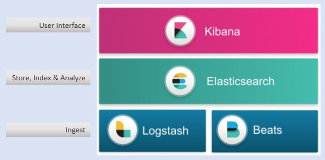
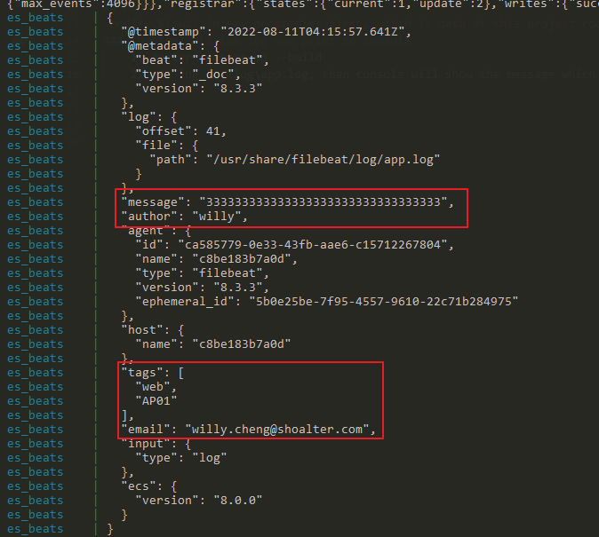
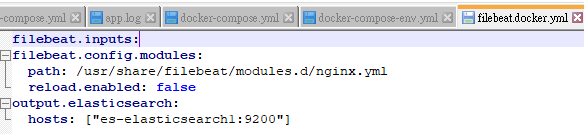
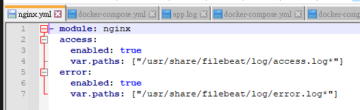
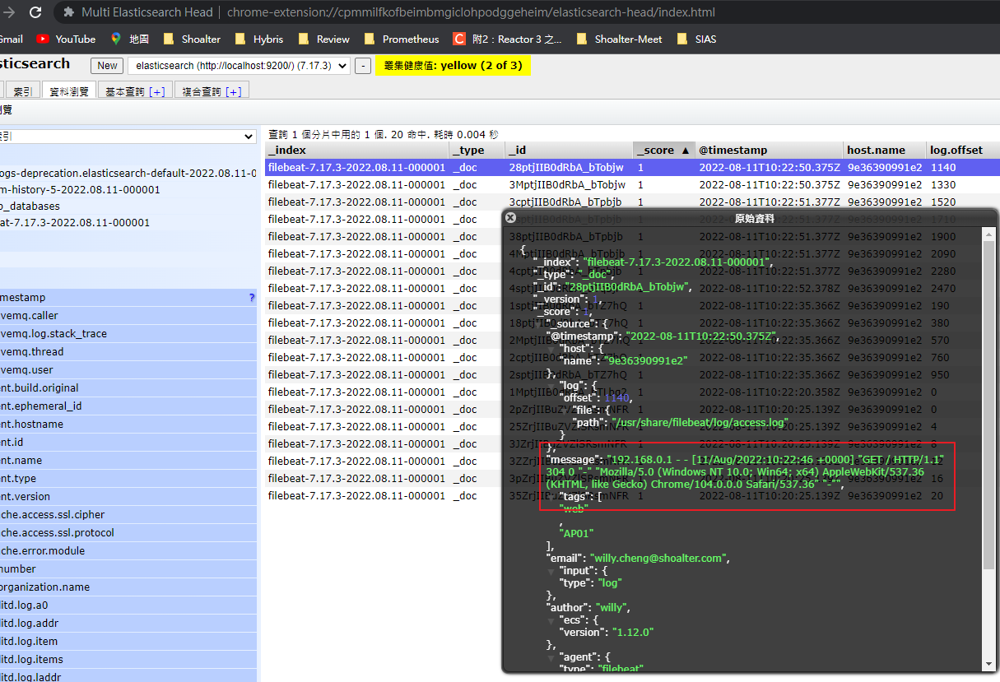
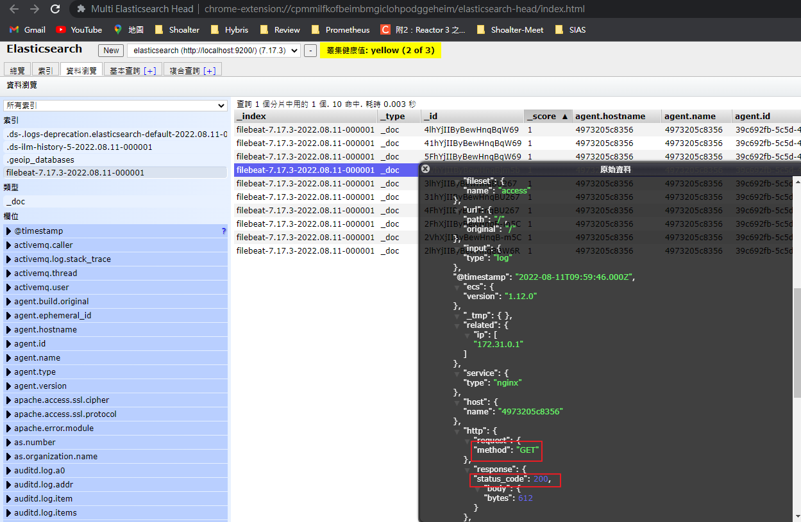

# Elastic Stack
1. 簡介
    
    Beats: 監聽log
   
    - FileBeats: 監聽log file, 需安裝在log file所在主機

    - MetricBeats(服務指標):
    

## Demo
`Modify ${pwd} in env.properties first, which is path of this project root directory.`

then start docker-compose with below script

`docker-compose --env-file ../.env up --build`
### Chapter1: Listen log and print to console
    1. docker-compose up --build
    2. add log in \log\app.log, then console will show the message which beats will output.

### Chapter2: Listen log and sync to ES
    1. docker-compose up --build
    2. add log in \log\app.log, then console will show the message which beats will output.

### Chapter3: Listen log, and assemble log to format,then sync to ES
> 修改input設定 (/filebeat.docker.yml)
>
>
>
> 設定log路徑 (/modules.d/nginx.yml)
> 
> 

    1. docker-compose up --build
    2. visit 'http://127.0.0.1/'(Nginx) to generate some logs 
    3. the message which sent to ES will be formated to specified format, but raw data.

Before

After
