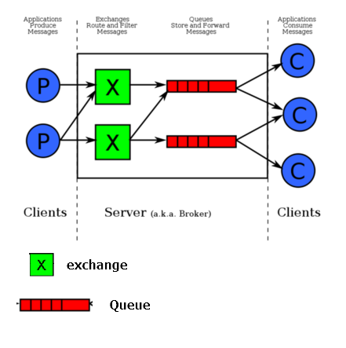
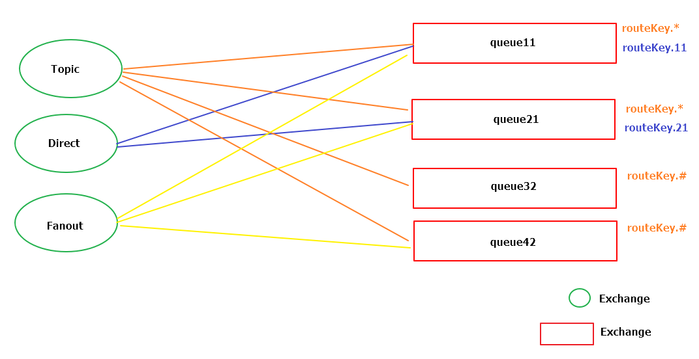

# RabbitMQ

1. 系統架構

    Queue: 存取Message的空間

    

    exchange: 接收message並依規則發送至適合的Queue

        Direct: 依據routing_key全文匹配找尋適合的queue
        Topic: routing_key可依據通配符設定發送的Queue
        Headers: 根據Head attr選定
        Fanout: 發送到所有Queue

    `routing_key以'.'分割，ex. animal.cat / animal.dog`

    `topic可以 (* | #) 表示字符`

    `*: 單一字符 => animal.* (animal.cat / animal.dog)`

    `#: 一或多個字符 => animal.# (animal.cat / animal.cat.age / animal.dog.leg.length)`
    

2. 程式架構

        com.willy.rabbitmq.rabbitmq.config.RabbitConfig
            設定Queue/Exchange/Binding (亦可參考setupExchangeAndQueue.bat用script設定)

        com.willy.rabbitmq.rabbitmq.listener.DefaultQueueListener
            監聽各Queue消息並print出來

        com.willy.rabbitmq.rabbitmq.po.UserPO
            Object Message用，必須implements Serializable

        com.willy.rabbitmq.rabbitmq.service.MQService
            發送message方法

        src.test.java.com.willy.rabbitmq.rabbitmq.RabbitmqApplicationTests
            測試個案

3. 測試案例

    Exchange訂閱圖
        

        basicSendAndListen: 直接send到queue
        
        objectMessage: send物件到queue
        
        sendMessageToDirect11Exchange: 透過Direct Exchange送{routeKey.11: message}到queue11
        
        sendMessageToDirect21Exchange: 透過Direct Exchange送{routeKey.21: message}到queue21
        
        sendOneCharKeyMessageToTopicExchange: 透過Topic Exchange觸發routeKey.*到queue11/queue21
        
        sendMutiCharKeyMessageToTopicA2Exchange: 透過Topic Exchange觸發routeKey.#到queue32/
        queue42
        
        sendMessageToFanoutExchange: 透過Fanout Exchange觸發任何routeKey到queue11/queue21/queue42