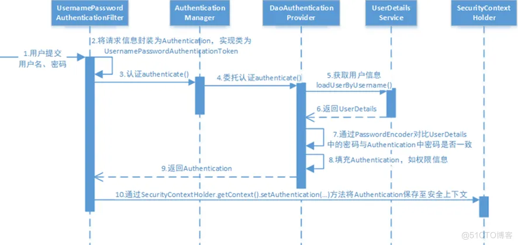

# 概述
Spring Security定義好一個驗證(Authentication)和授權(Authorization)流程，各app僅需implements其提供的interfaces，Security就會透過多個Filter依設定驗證每個request是否有權訪問resource

需要實現的方法

* 哪些page需要授權
* login/logout/login fail/unauthorized page url
* 如何取得UserDetails (name/password/enable...)
* 登入驗證方式 (username/pwd or jwt...)
* <resource, role> mapping, 可存取resource的role有哪些

# Spring Security 有三個核心概念

* Principle : 代表使用者的物件
* Authority : 代表使用者的角色
* Permission : 代表授權

# Spring Security 核心物件

* Authentication : 包含Principal、Credentials 和Authorities 的一個物件
    
    * Principal: Username
    * Credentials: Password，若是使用Token 時，Credentials 則可能是Token
    * Authorities: 該User擁有的的角色 ex. ROLE_ADMIN / ROLE_VIP
* SecurityContext : 一個驗證過的Authentication 物件。
* SecurityContextHolder : 用來儲存驗證過的Authentication ，也就是負責管理SecurityContext。
* AuthenticationManager : 用於定義Spring Security 的Filter 如何執行身分驗證的API。
* AuthenticationProvider : 用於執行特定類型的身分驗證，如DaoAuthenticationProvider 用於使用者名稱和密碼* 的身分驗證，而JwtAuthenticationProvider 用於對JWT 令牌進行身分驗證。
    * 表單的認證（Cookie & Session）
    * JWT（Json Web Token）
    * Oauth 認證
* ProviderManager : AuthenticationManager 最常用的實作類別，負責管理AuthenticationProvider。
* UserDetails : 作為封裝使用者資訊的物件(Principle/Credentials/Authorities)
* UserDetailsService : 用來載入使用者資訊

# 程式碼解析

## 1. 設定登入/登出頁、哪些畫面需要驗證

* SecurityConfig.java 繼承WebSecurityConfigurerAdapter，並override部分方法

com.willy.spring.security.config.SecurityConfig#configure
    
    設定request是permitAll(不需權限) / authenticated (需要登入) / hasAuthority (需要登入並只允許特定角色) 
    設定登入成功/失敗/授權失敗/登出頁面

com.willy.spring.security.config.SecurityConfig#configureGlobal

    1. 設定UserDetailService物件
    2. override密碼的加密及驗證方式

## 2. 讓Security存取userDetails
* MyUserDetailsService.java implements UserDetailsService，實現撈取UserDetails方法

UserDetails: 一個擁有預設method的interface，用來提供security驗證的interface

## 3. 讓Security取得<Resource,Role>Mapping
* MyResourcesRoleMapService.java implements FilterInvocationSecurityMetadataSource, 實現<resource, authorizedRole> mapping

## 4. 根據<Resource,Role>Mapping判斷role是否可存取resource
* MyAccessDecisionManager.java implements AccessDecisionManager interface, 實現決定該User是否能訪問resource的驗證邏輯

# 參考
https://ithelp.ithome.com.tw/articles/10279271