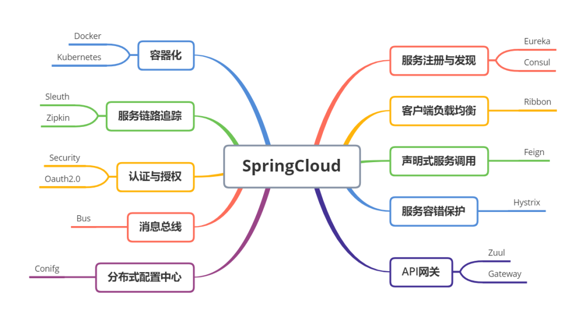
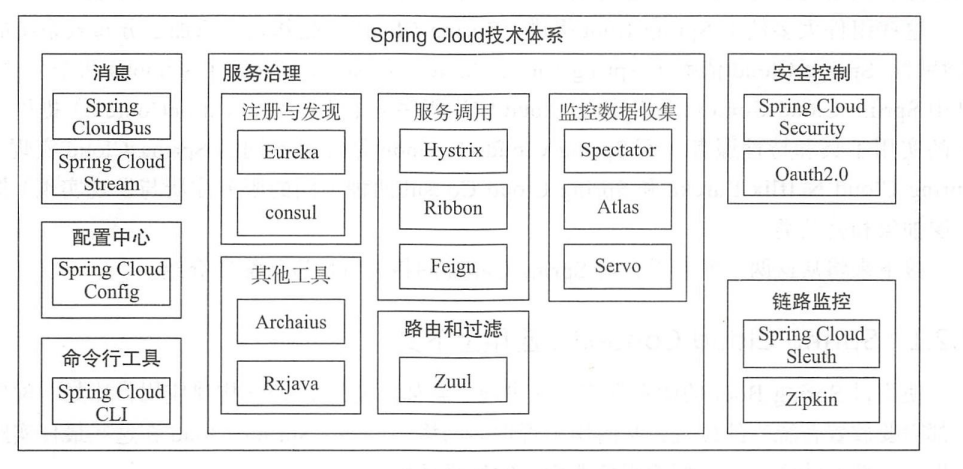

# Spring Cloud
此專案將實現各項Spring Clould Framework功能，藉此了解Spring Clould生態圈

## Config Server
### 各為服務的配置中心，可依serviceName/profile區隔不同的設定檔，放在github...地方，由config server做管理，避免修改配置時，需些改多個micro service的YAML
* spring-cloud-config-server: Spring配置中心，統一管理各Server使用的application.yml資訊，各Server只需設定好連線資訊，即可透過@ConfigurationProperties將線上的yml設定檔注入pojo bean中
* spring-cloud-config-client: 從spring-cloud-config-server讀取設定檔的範例程

## Service Discovery
### 為避免多個服務間透過ip互相調用，各服務(Producer)啟動時註冊到服務發現中心，會儲存<service,ip>，服務消費者(Customer)透過service name調用時可透過LoadBalancer分配制不同server。服務發現server也會對各producer進行health check，當producer掛掉時將其從list中剃除
* eureka-server: 服務發現Server，各服務會主動註冊到這
* eureka-producer: 在yml設定eureka server URL式，可依需求配置到其他project，或藉此了解如何配置，server.port自動配置，可以啟動多次模擬多個pod

### reference
服務發現Framework比較: https://blog.csdn.net/fly910905/article/details/100023415

Eureka詳解: https://blog.csdn.net/sunhuiliang85/article/details/76222517

# 參考
https://www.readfog.com/a/1641704292720152576

