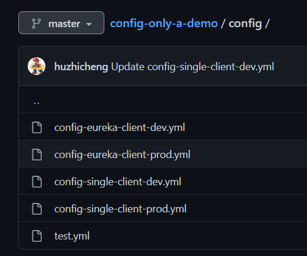

# Spring Cloud Config Server
Spring cloud配置中心，讓cloud各service能夠動態存取更新config

# 配置
* application.yml 設定config file的路徑，以下以github上的檔案為例，config file檔案命名<appName>-<profile>.yml

        spring:
            cloud:
                config:
                server:
                    git:
                    uri: https://github.com/huzhicheng/config-only-a-demo #config file git repository
                    default-label: master #config branch
                    search-paths: config  #config directory

* 設定完成就能透過API取得設定檔內容

    允許格式如下
    * /{application}/{profile}[/{label}]
    * /{application}-{profile}.yml
    * /{label}/{application}-{profile}.yml
    * /{application}-{profile}.properties
    * /{label}/{application}-{profile}.properties
    
    http://127.0.0.1:3301/config-single-client/dev/
    
    http://127.0.0.1:3301/config-single-client/dev/master