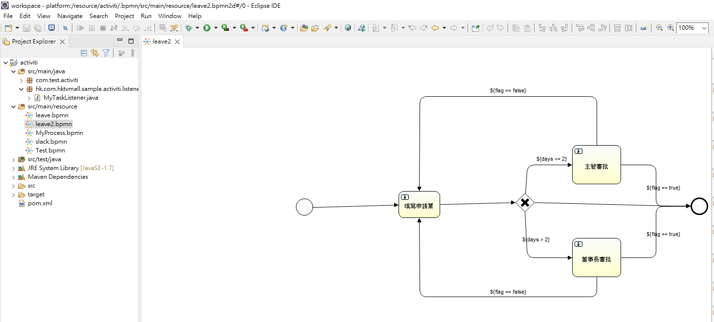
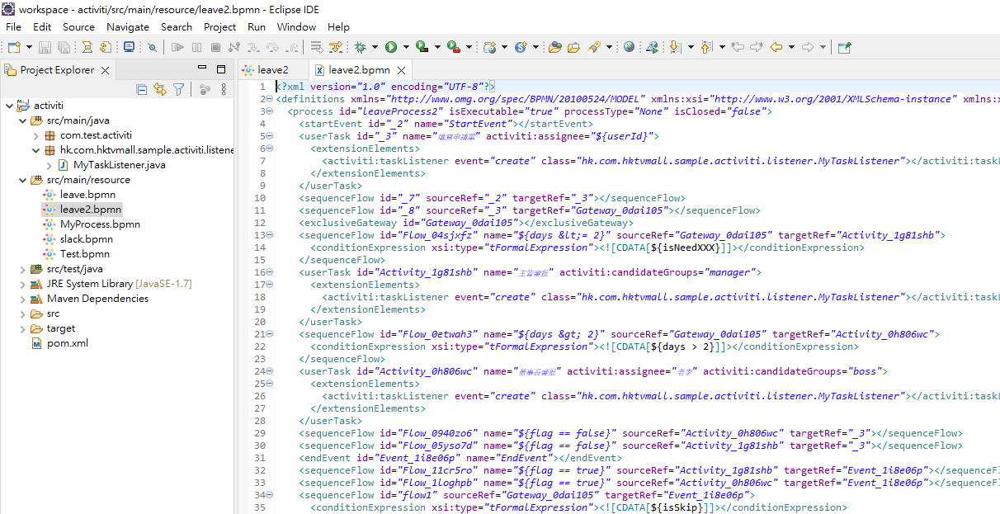
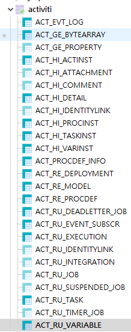
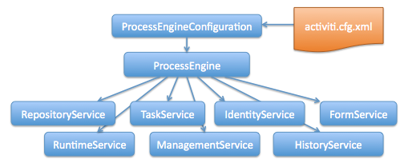

## 概述
Activiti 是一個開源的流程引擎，可透過BPMN規範的圖形定義流程，並產生*.bpmn文件，實現多個流程的流程管理

專案中提供幾個案例，測試流程皆放在hk.com.hktvmall.sample.activiti.sample 裡，可透過ActivitiApplication 逐個做測試，對應的BPMN文件放在resources/process裡，可用eclipse plugin(安裝方式如下)或https://demo.bpmn.io/ 檢視 (bpmo.io僅適合用來檢視，他的xml語法定義不適用)

範例流程簡介: 

LeaveSample : 基本請假流程

Leave2Sample : 請假流程/流程判斷/變數/指定承辦人/指定承辦Group

SlackSample : Slack發送訊息流程功課

Leave2ListenerSample: Leave2Sample 加上Listener功能，類似Spring AOP在Event發生時執行特定動作(ex. 送到主管階段時發Mail通知)

OtherFunction : Activiti其他功能演示

## 設計流程步驟

> 定義流程

-  安裝IDE Plugin繪製流程圖，Plugin會自動產生流程圖對應的.bpmn檔

    Intellij: Flowable BPMN visualizer …等　(僅適用IntelliJ IDEA Ultimate版)

     Eclipse: Activiti Eclipse BPMN 2.0  (refer to https://productresources.collibra.com/docs/admin/5.5/Content/Eclipse/ta_install-activiti-eclipse.htm )

     

     
     
> 部屬流程

- Activiti整合進Springboot後會自動進行部屬的步驟

> 啟動流程
    
- 由程式啟動、管理流程

## 資料庫結構
> Activiti啟動後會自動產生25個”ACT”開頭的Table存放流程相關資料
    ACT_${類別}_${名稱} 

    GE: General: 一般資料

    HI: History: 歷史資料: 可查詢流程行進間每階段的紀錄，含起始結束時間/執行人/輸入資料(ACT_HI_VARINST)…

    ACT_HI_ACTINST: 流程每階段過程

    ACT_HI_PROCINST: 流程Summary資料

    ACT_HI_VARINST: 流程定義資料

    RE: Repository: 流程設定資料

    ACT_RE_DEPLOYMENT:　流程部屬資料

    ACT_RE_PROCDEF: 流程定義資料

    RU: Runtime: 流程運行時相關資料

    ACT_RU_TASK: 目前為完結的流程被稱為Task，可在這找到未完成流程的案件

    ACT_RU_VARIABLE:未完成流程使用到的變數

## Activiti提供的Service

> 為節省流程操作的繁雜過程，Activity提供了多個Service供User簡易操作，以下介紹幾個常用Service

- RuntimeService: 流程運行相關功能 (ex. 啟動流程) → 對應RU表

- TaskService: Task管理相關功能 (ex. 撈出行進間的流程進行下一步)

- HistoryService: 歷史資料管理 (ex. 撈出流程過去行進紀錄)→ 對應HI表

- RepositoryService: 資源管理 (ex. 流程部屬)→ 對應RE表
